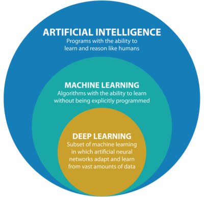

# AI, ML, and DL Distinctions

Understanding the distinctions between **Artificial Intelligence (AI)**,
**Machine Learning (ML)**, and **Deep Learning (DL)** is crucial for
grasping the broader landscape of modern technology. Each field is
related but serves a distinct role in building intelligent systems.

[Image
Credit](https://www.qubole.com/blog/deep-learning-the-latest-trend-in-ai-and-ml)

------------------------------------------------------------------------

## 1. Artificial Intelligence (AI)

**Artificial Intelligence (AI)** refers broadly to any technique
enabling computers to mimic human intelligence or behaviors. AI aims to
build intelligent agents capable of performing tasks that typically
require human intellect, such as reasoning, problem-solving,
understanding language, recognizing patterns, and decision-making.

### **Subfields and Examples:**

-   **Rule-based Systems**: Decision trees, expert systems.
-   **Machine Learning**: Algorithms learning from data.
-   **Natural Language Processing (NLP)**: Chatbots, virtual assistants.
-   **Robotics**: Autonomous robots and drones.

------------------------------------------------------------------------

## 2. Machine Learning (ML)

**Machine Learning** is a subset of AI focused specifically on
algorithms that enable computers to learn from data and improve their
performance over time without explicit programming. ML identifies
patterns, makes predictions, or categorizes data based on learned
experiences.

### **Key Characteristics:**

-   Algorithms learn directly from data.
-   Performance improves with more data.
-   Emphasis on statistical modeling and pattern recognition.

### **Types of Machine Learning:**

-   **Supervised Learning**: Learning from labeled data (e.g., spam
    detection, image classification).
-   **Unsupervised Learning**: Learning patterns from unlabeled data
    (e.g., clustering, anomaly detection).
-   **Reinforcement Learning**: Learning via interactions with the
    environment (e.g., game playing, robot navigation).

### **Popular Algorithms:**

-   Linear Regression, Decision Trees, Random Forests, Support Vector
    Machines (SVMs).

------------------------------------------------------------------------

## 3. Deep Learning (DL)

**Deep Learning** is an advanced subset of Machine Learning inspired by
the structure of the human brain. DL utilizes artificial neural networks
composed of interconnected layers to model complex relationships and
abstract patterns in large-scale and high-dimensional data.

### **Key Features:**

-   Utilizes multi-layered neural networks (“deep” neural networks).
-   Capable of automatic feature extraction from raw data.
-   Excels at handling unstructured data such as images, audio, text,
    and video.

### **Common Neural Network Architectures:**

-   **Feedforward Neural Networks (FFNN)**: Standard neural network
    structures.
-   **Convolutional Neural Networks (CNN)**: Used extensively for image
    and video processing.
-   **Recurrent Neural Networks (RNN)**: Specialized for sequence data
    and language tasks.

### **Popular Applications:**

-   Image recognition (e.g., facial recognition, medical imaging).
-   Natural language processing (e.g., speech recognition, chatbots).
-   Autonomous driving and robotics.

------------------------------------------------------------------------

## Summary of Distinctions

<table>
<colgroup>
<col style="width: 42%" />
<col style="width: 30%" />
<col style="width: 26%" />
</colgroup>
<thead>
<tr>
<th>Artificial Intelligence (AI)</th>
<th>Machine Learning (ML)</th>
<th>Deep Learning (DL)</th>
</tr>
</thead>
<tbody>
<tr>
<td>Broad field aiming to simulate human intelligence.</td>
<td>Subset of AI; systems learn from data.</td>
<td>Subset of ML; complex neural networks.</td>
</tr>
<tr>
<td>Includes rule-based systems, ML, robotics.</td>
<td>Includes supervised, unsupervised, reinforcement learning.</td>
<td>Specifically multi-layer neural networks.</td>
</tr>
<tr>
<td>Encompasses diverse techniques (symbolic, statistical).</td>
<td>Primarily statistical methods to learn patterns from data.</td>
<td>Advanced learning of complex data representations directly from raw
input.</td>
</tr>
</tbody>
</table>

------------------------------------------------------------------------

**In short:**

-   **AI** encompasses all intelligent computer systems.
-   **ML** allows AI systems to learn from data without explicit
    instructions.
-   **DL** is a sophisticated form of ML utilizing layered neural
    networks to analyze intricate patterns in large datasets.

Understanding these distinctions provides clarity in navigating the
evolving landscape of AI-driven technologies.
