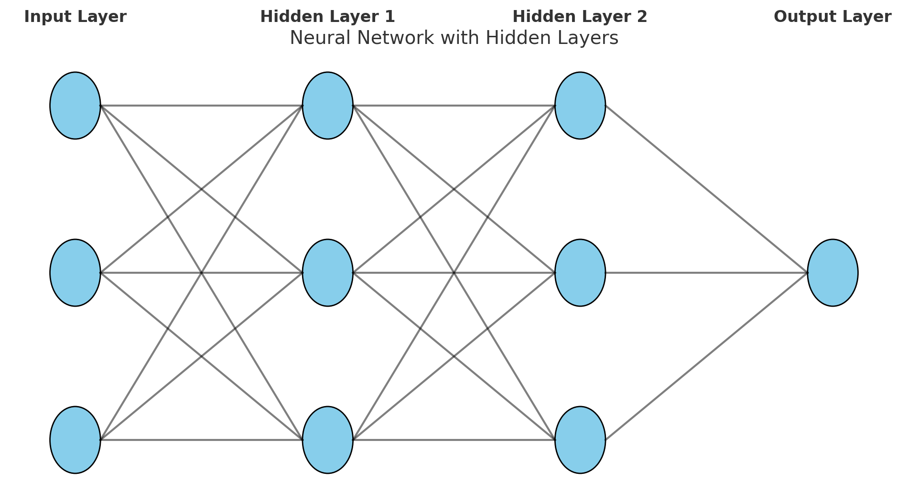

# What is a Hidden Layer?

In deep learning, a **hidden layer is a middle layer between the input and the output layers**.  
It is called "hidden" because **we do not see its inputs or outputs directly; they are inside the model.**

---

## Layman Explanation:

Imagine you are **baking a cake**:
1. **Inputs:** You provide flour, sugar, eggs, and milk.
2. **Hidden Layer:** The cake is mixed, baked, and decorated (this is the hidden process—you don’t see each step separately inside the oven).
3. **Output:** You get a delicious cake.

Similarly in a deep learning model:
- **Inputs:** Raw data (like pixels, numbers, text).
- **Hidden Layer:** The model processes the data step by step, transforming it in **ways we cannot directly see**.
- **Output:** Final result (like 'Cat' or 'Dog').

---

## Why is it called "Hidden"?
- Because **we cannot observe or understand its work directly**.
- It is like a **black box**, but it does the crucial job of **extracting patterns and features from data**.

---

## Why do we need hidden layers?

| Reason                            | Explanation                                           |
|------------------------------------|-------------------------------------------------------|
| Extract complex patterns            | Helps the model detect complex relationships in data  |
| Add flexibility                     | Allows the model to learn non-linear decisions        |
| Build deep models (Deep Learning)   | Stacking many hidden layers makes deep learning work  |

---

## Simple Analogy:
Imagine your brain is trying to decide if a picture is of a **cat or a dog**.
- **Input layer:** Sees the raw image.
- **Hidden layers:** Neurons might detect edges, shapes, whiskers, tails (step by step).
- **Output layer:** Finally decides → Cat or Dog.

> **Without hidden layers → the model would only see raw pixels and try to guess directly (which is very hard).  
> With hidden layers → the model breaks down the problem into small steps and makes better decisions.**

---

## Visual Representation:

```bash
[Input Layer]} → [Hidden Layer 1] → [Hidden Layer 2] → [Output Layer]
```

```bash
{Raw Data} → {Extract patterns} → {Combine patterns} → {Final Prediction}
```


