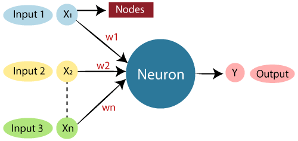
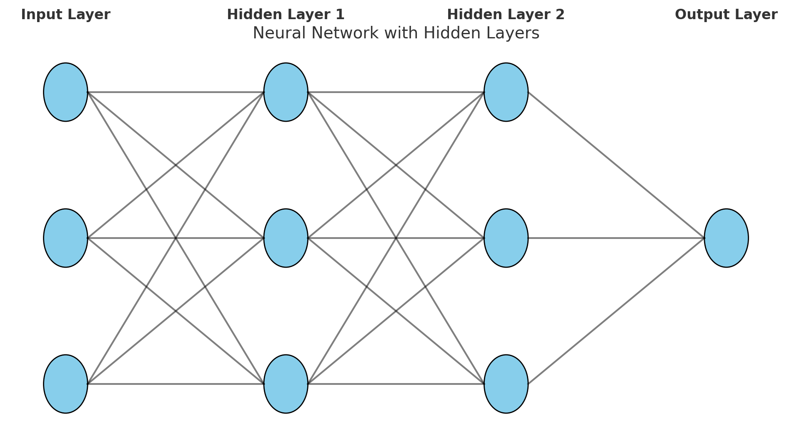

# Neuron

An **artificial neuron** is a **mathematical function that mimics the behavior of a biological neuron** in our brain.  
It **receives multiple inputs, processes them using weights, adds bias, and passes them through an activation function to produce an output**.

It is the **core building block of any neural network**.

Image credit: ([link](https://www.jaroeducation.com/blog/complete-guide-to-artificial-neural-networks/))

---

## Structure of an Artificial Neuron

1. **Inputs:**  
   - Data (features), e.g., Age, Income, etc.

2. **Weights:**  
   - Importance given to each input.

3. **Summation:**  
   - Weighted sum of inputs:  

$$
z = \sum (w_i \times x_i) + b
$$

4. **Activation Function:**  
   - Applies a function to add non-linearity (like decision-making).
   - Examples: Sigmoid, ReLU, Tanh.

5. **Output:**  
   - Result after applying activation function.

---

## Mathematical Formula

$$
\text{Output} = Activation\left(\sum_{i=1}^{n} (w_i \times x_i) + b\right)
$$

Where:
- $w_{i}$ = weight
- $x_{i}$ = input
- $b$ = bias
- $Activation()$ = function like Sigmoid, ReLU

---

## Analogy:
Imagine you are a **teacher grading students** based on:
- Homework (weight = 0.4)
- Exam (weight = 0.6)

You add the scores with different importance:

$$
\text{Final Grade} = (\text{Homework} \times 0.4) + (\text{Exam} \times 0.6)
$$

If the **result is above a threshold**, you decide **Pass**; else, **Fail**.

This is what a neuron does!

---

## Key Concepts in Artificial Neuron

| Component             | Role                                       |
|-----------------------|--------------------------------------------|
| Inputs (x1, x2, ...)   | Raw data                                |
| Weights (w1, w2, ...) | Importance of each input                |
| Bias (b)            | Adjustment to the output                   |
| Summation               | Weighted sum of inputs and bias            |
| Activation Function     | Adds non-linearity (like decision-making)  |
| Output                  | Final result                               |

---

## Why do we use **Activation Functions** in Neurons?
- **Without activation function:** The neuron would behave like a simple linear equation (a straight line).
- **With activation function:** Neuron can model **non-linear relationships**.
- This makes the model **powerful enough to solve complex problems like image or speech recognition**.

---

## Visual Representation of an Artificial Neuron

## Why So Many Neurons in One Hidden Layer?

### 1. Each Neuron Learns a Pattern (Feature Extractor)
* Every neuron in a hidden layer learns a specific pattern or relationship between input features.
* Example:
    * One neuron might learn how **Glucose affects Diabetes**.
    * Another might learn how **BMI interacts with Age**.
    * Another might learn **combined effects** (e.g., high insulin + high glucose).

> **More neurons → More patterns/features can be learned.**

### 2. Complex Data Requires More Capacity
* Real-world data (like health data) is **not linearly separable**.
* Complex relationships need **more neurons to model non-linear boundaries**.
* Example: A single neuron can model a line, but many neurons together can model curves, clusters, and intricate decision boundaries.

> **More neurons → Better ability to capture complex patterns.**

### 3. Universal Approximation Theorem
* The theorem states that a neural network with **at least one hidden layer with sufficient neurons** can approximate any continuous function.
* But this doesn’t mean **infinite neurons** are good. Balance is key.

| Layer          | Typical Neurons Example                                   | Why?                                     |
| -------------- | --------------------------------------------------------- | ---------------------------------------- |
| Input Layer    | Matches number of features (e.g., 8 for diabetes dataset) | 1 neuron per feature                     |
| Hidden Layer 1 | 2x-3x of input neurons (e.g., 16)                         | Capture various combinations of features |
| Hidden Layer 2 | Smaller than first hidden layer (e.g., 8)                 | Condense and refine patterns             |
| Output Layer   | Depends on task (1 neuron for binary classification)      | Gives the final prediction               |

### Analogy
* Imagine neurons are **workers in a factory**.
* More workers (neurons) can **process more raw materials (input features)**.
* Too few workers → can't handle complex tasks.
* Too many workers → waste of resources, possible errors (overfitting).

#### Be careful

| Problem          | Cause                                  | Solution                                   |
| ---------------- | -------------------------------------- | ------------------------------------------ |
| **Underfitting** | Too few neurons, model too simple      | Add more neurons/layers                    |
| **Overfitting**  | Too many neurons, model memorizes data | Reduce neurons, add regularization methods |

* More neurons in hidden layers → better at learning complex patterns.
* But too many neurons → risk of overfitting.
* You want just enough neurons to learn well but generalize well.

## Thumb Rules for Choosing Number of Neurons in Hidden Layers
### 1. Rule of Pyramid Shape
* **First hidden layer**: 2x to 3x the number of input features.
* **Subsequent hidden layers**: Gradually decrease the number of neurons.
* Forms a **pyramid shape** from input to output.
* Example (for Diabetes Dataset with 8 features):
  
    * Hidden Layer 1: 16-24 neurons
    * Hidden Layer 2: 8-12 neurons
    * Output Layer: 1 neuron (binary classification)

### 2. Between Input & Output Size
A simple formula to start:

$$
\large \text {Neurons in Hidden Layer} = \frac{Input Neurons + Output Neurons}{2}
$$

* For Diabetes Dataset:
    * Input = 8, Output = 1 → Hidden Layer ≈ 4-5 neurons.
* Simple, fast, and works for basic problems.

### 3. Heuristic: Power of 2
* Start with neuron counts like 8, 16, 32, 64.
* Common in deep learning.
* Easy to scale and optimize later.

### 4. Don’t Over-Engineer Early
* Start small (e.g., 1 hidden layer, 8-16 neurons).
* Increase only if:
    * Model underfits (low train accuracy & high error).
    * Model can't learn patterns.

### 5. Empirical Tuning is Key
* Use **grid search** or **random search** for tuning neurons.
* Monitor **validation accuracy & loss curves**.
* Avoid blindly adding neurons.

### 6. Regularization is Important
* If using too many neurons:
    * Add Dropout layers.
    * Use L2 regularization (Ridge penalty).
* Helps prevent overfitting.

| Dataset Size          | Recommended Neurons (Hidden Layer 1) | Why?                                         |
| --------------------- | ------------------------------------ | -------------------------------------------- |
| Small (<1k samples)   | 1-2x input features                  | Avoid overfitting                            |
| Medium (10k samples)  | 2-3x input features                  | Balance complexity & generalization          |
| Large (>100k samples) | Start with higher (32-64 neurons)    | Can afford more capacity without overfitting |

## Why Do We Need Many Hidden Layers in Neural Networks?

### 1. Shallow vs Deep Neural Networks
* A **shallow network** has only **1 hidden layer**.
* A **deep neural network** has **2 or more hidden layers**.
* Adding **depth (more layers)** enables the model to learn **hierarchical features**.

### 2. Simple Problems → Few Layers
* For **simple linear problems** (e.g., linear regression), a single hidden layer might be enough.
* But real-world problems (images, speech, text, medical data) involve complex non-linear patterns.

### 3. Why More Hidden Layers?

| Hidden Layers        | Role / Purpose                                                                  |
| -------------------- | ------------------------------------------------------------------------------- |
| **1st hidden layer** | Learns basic features (e.g., edges in images, basic relations in data)          |
| **2nd hidden layer** | Learns more abstract features (e.g., shapes, combinations of previous features) |
| **3rd & beyond**     | Learns complex patterns (e.g., object parts, interactions, high-level concepts) |

* Each layer **builds upon previous layers**.
* More hidden layers → **More abstract & high-level features**.

### 4. Real-World Example
* Image Recognition:
    * Layer 1: Detects edges, colors.
    * Layer 2: Detects shapes (circles, squares).
    * Layer 3: Detects objects (eyes, mouth, wheels).
    * Output: Classifies image (cat, dog, car).

### 5. Mathematical Justification
* **Universal Approximation Theorem** says 1 hidden layer can approximate any function.
* But **deep networks are more efficient**:
    * They require **fewer neurons per layer**.
    * Better at **reusing features**.
    * More scalable for **complex tasks**.

### 6. Practical Reasons for Many Layers

| Reason                      | Why It Helps                                         |
| --------------------------- | ---------------------------------------------------- |
| **Hierarchical Learning**   | Learns from simple to complex patterns step-by-step. |
| **Reusability of Features** | Lower layers learn features reused by higher layers. |
| **Better Representations**  | Can model very complex non-linear relationships.     |
| **Scalability**             | Easier to handle large datasets & tasks.             |

### 7. But Beware of Overfitting!
* More layers → More parameters → Higher risk of overfitting.
* Solution:
    * Use **Dropout, Batch Normalization, Regularization**.
    * Increase data (Data Augmentation).

* More hidden layers help neural networks learn complex, abstract patterns.
* Useful for tasks like image recognition, speech, language understanding, and medical predictions.

### Key Takeaways:
- **Neuron is the smallest unit in an Artificial Neural Network.**
- It **transforms inputs into meaningful outputs using weights, bias, and activation function.**
- Multiple neurons connected together form layers that can solve **very complex tasks like face recognition, language translation, etc.**

