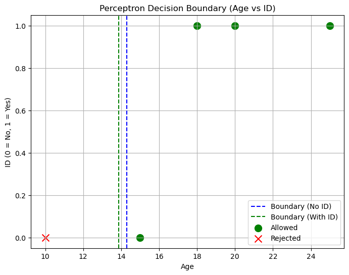
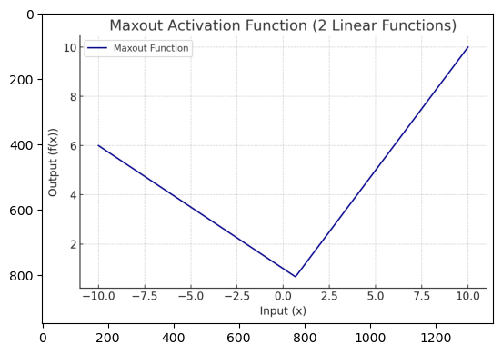

# 1. Perceptron

The **perceptron** is the simplest form of an artificial neural network, consisting of a single-layer structure. It can classify data into two distinct classes (binary classification). It is created by **Frank Rosenblatt in 1958**. It is the **basic building block of deep learning models**.

## How does a perceptron work?
- **Inputs**: Raw data provided to the perceptron.
    Example: Check if a person can enter a club:
   - Age
   - Has an ID (Yes or No)
- **Weights**: Numeric values assigned to inputs determining their importance.
   - Age might have a weight of 0.7
   - ID might have a weight of 0.3
- **Weighted Sum:**  
<script src="https://polyfill.io/v3/polyfill.min.js?features=es6"></script>
<script id="MathJax-script" async
  src="https://cdn.jsdelivr.net/npm/mathjax@3/es5/tex-mml-chtml.js">
</script>

$
\text{Output} = (Age \times 0.7) + (ID \times 0.3)
$

- **Bias**: Adjusts the decision boundary of the neuron.
- **Activation Function**: Usually a step function in a perceptron, determining neuron output.
    - If the result is above a certain threshold (say 10), allow the person inside.
    - Otherwise, reject them.

## Perceptron Learning Algorithm:
- Initialize weights randomly.
- Adjust weights based on prediction errors iteratively until predictions match actual labels.

### Example:

| Person | Age | Has ID (1=yes, 0=no) | Calculation                     | Decision  |
|--------|-----|----------------------|---------------------------------|-----------|
| A      | 20  | 1                    | 20×0.7 + 1×0.3 = 14.3           | Allowed   |
| B      | 15  | 0                    | 15×0.7 + 0×0.3 = 10.5           | Allowed   |
| C      | 10  | 0                    | 10×0.7 + 0×0.3 = 7              | Rejected  |

---

### In Short:

| Term              | Meaning for Layman                             | Example                                                   |
|-------------------|------------------------------------------------|-----------------------------------------------------------|
| Biological Neuron | Brain cell that sends messages                 | Your brain tells your hand to pull from a hot object      |
| Artificial Neuron | A math formula that mimics a neuron            | Checks if a person can enter a club based on age & ID     |
| Perceptron        | The simplest artificial neuron (first model)   | Takes inputs, weights them, sums them, makes a decision   |

### Visual Analogy
Imagine a **gatekeeper at a club**:
- Checks people's age and ID.
- Uses a simple rule: if your combined score is above a threshold → you're in.
- This is exactly how a **perceptron** works.


```python
import numpy as np

# Step 1: Define inputs (Age, ID)
X = np.array([
    [20, 1],
    [15, 0],
    [10, 0],
    [25, 1],
    [18, 1]
])

# Step 2: Define weights (Age weight, ID weight)
weights = np.array([0.7, 0.3])

# Step 3: Define threshold
threshold = 10

# Step 4: Activation function (Step function)
def perceptron_output(x):
    # Calculate weighted sum
    weighted_sum = np.dot(x, weights)
    # Apply step function
    return np.where(weighted_sum >= threshold, 1, 0)

# Step 5: Get output
outputs = perceptron_output(X)

# Display results
for i, (person, result) in enumerate(zip(X, outputs)):
    decision = "Allowed" if result == 1 else "Rejected"
    print(f"Person {i+1}: Age={person[0]}, ID={person[1]} → {decision}")
```

    Person 1: Age=20, ID=1 → Allowed
    Person 2: Age=15, ID=0 → Allowed
    Person 3: Age=10, ID=0 → Rejected
    Person 4: Age=25, ID=1 → Allowed
    Person 5: Age=18, ID=1 → Allowed
    


```python
import matplotlib.pyplot as plt

# Create grid
age = np.linspace(5, 30, 100)
id_yes = np.ones_like(age)
id_no = np.zeros_like(age)

# Calculate decision line (Age where decision boundary occurs if ID is 0 or 1)
boundary_age_id_yes = (threshold - 0.3 * 1) / 0.7
boundary_age_id_no = threshold / 0.7

plt.figure(figsize=(8,6))

# Plot decision boundary
plt.axvline(x=boundary_age_id_no, color='blue', linestyle='--', label='Boundary (No ID)')
plt.axvline(x=boundary_age_id_yes, color='green', linestyle='--', label='Boundary (With ID)')

# Plot actual points
for i, point in enumerate(X):
    if outputs[i] == 1:
        plt.scatter(point[0], point[1], color='green', marker='o', s=100, label='Allowed' if i==0 else "")
    else:
        plt.scatter(point[0], point[1], color='red', marker='x', s=100, label='Rejected' if i==2 else "")

plt.title('Perceptron Decision Boundary (Age vs ID)')
plt.xlabel('Age')
plt.ylabel('ID (0 = No, 1 = Yes)')
plt.legend()
plt.grid(True)
plt.show()
```


    

    


#### Explanation of the plot:
* **Dashed blue line**: Age required to pass if no ID.
* **Dashed green line**: Age required to pass if has ID.
* **Green dots**: Allowed.
* **Red crosses**: Rejected.

#### Summary (For Layman)
* Perceptron is like a simple rule-based system.
* It learns to make decisions by adjusting weights and checking if the sum crosses a threshold.
* It works best for simple problems (linearly separable problems).
* For complex problems (like images, speech), we need multi-layer perceptrons (deep networks).

## Perceptron Learning Rule

### What is the Perceptron Learning Rule?
The **Perceptron Learning Rule** is a simple method that allows the perceptron to **adjust its weights automatically based on errors**.

### Key Idea:
1. Start with **random or zero weights**.
2. For each data point:
   - Predict the output.
   - Compare the predicted output to the actual label.
   - If wrong, **adjust the weights**.
3. Repeat until no errors.

---

### Perceptron Learning Rule Formula
<script src="https://polyfill.io/v3/polyfill.min.js?features=es6"></script>
<script id="MathJax-script" async
  src="https://cdn.jsdelivr.net/npm/mathjax@3/es5/tex-mml-chtml.js">
</script>


$$
\text{New Weight} = \text{Old Weight} + (\text{Learning Rate} \times \text{Error} \times \text{Input})
$$

Where:
- **Error = Actual Output - Predicted Output**
- **Learning Rate (α):** Small positive number (e.g., 0.1) to control how much we adjust the weights.

---

### Example: Learn the AND logic gate using perceptron

| Input X1 | Input X2 | Expected Output |
|----------|----------|-----------------|
| 0        | 0        | 0               |
| 0        | 1        | 0               |
| 1        | 0        | 0               |
| 1        | 1        | 1               |

---

### Step-by-Step:

#### Initial Settings:
- Weights: w1 = 0, w2 = 0
- Bias: b = 0
- Learning Rate (α) = 0.1

#### Iteration 1 (Epoch 1):
For each data point:

1. Input: (0, 0)  
   Weighted sum = 0×0 + 0×0 + 0 = 0  
   Predicted Output = 0 (threshold = 0)  
   Error = 0 - 0 = 0  
   ➡ No update.

2. Input: (0, 1)  
   Weighted sum = 0×0 + 0×1 + 0 = 0  
   Predicted Output = 0  
   Error = 0 - 0 = 0  
   ➡ No update.

3. Input: (1, 0)  
   Weighted sum = 0×1 + 0×0 + 0 = 0  
   Predicted Output = 0  
   Error = 0 - 0 = 0  
   ➡ No update.

4. Input: (1, 1)  
   Weighted sum = 0×1 + 0×1 + 0 = 0  
   Predicted Output = 0  
   Error = 1 - 0 = 1  

   **Weight update:**  
   - w1 = 0 + 0.1 × 1 × 1 = 0.1  
   - w2 = 0 + 0.1 × 1 × 1 = 0.1  
   - b = 0 + 0.1 × 1 = 0.1

---

#### Iteration 2 (Epoch 2):
Repeat with updated weights:

1. Input: (0, 0)  
   Weighted sum = 0×0 + 0×0 + 0.1 = 0.1  
   Predicted Output = 1  
   Error = 0 - 1 = -1  

   **Update:**  
   - w1 = 0.1 + 0.1 × -1 × 0 = 0.1  
   - w2 = 0.1 + 0.1 × -1 × 0 = 0.1  
   - b = 0.1 + 0.1 × -1 = 0  

... Continue until no errors.

#### Typically, in 3-4 epochs, the perceptron will learn the correct weights.

---


```python
# AND gate inputs and labels
X = np.array([
    [0, 0],
    [0, 1],
    [1, 0],
    [1, 1]
])
y = np.array([0, 0, 0, 1])

# Initialize weights and bias
weights = np.zeros(2)
bias = 0
learning_rate = 0.1

# Activation function
def activation(x):
    return 1 if x >= 0 else 0

# Training loop
for epoch in range(10):  # Maximum 10 epochs
    print(f"\nEpoch {epoch+1}")
    errors = 0
    for xi, target in zip(X, y):
        # Calculate weighted sum
        weighted_sum = np.dot(xi, weights) + bias
        # Apply step function
        prediction = activation(weighted_sum)
        # Calculate error
        error = target - prediction
        # Update weights and bias
        weights += learning_rate * error * xi
        bias += learning_rate * error

        if error != 0:
            errors += 1
        print(f"Input: {xi}, Prediction: {prediction}, Error: {error}, New Weights: {weights}, Bias: {bias}")

    if errors == 0:
        print("\nTraining complete.")
        break
```

    
    Epoch 1
    Input: [0 0], Prediction: 1, Error: -1, New Weights: [0. 0.], Bias: -0.1
    Input: [0 1], Prediction: 0, Error: 0, New Weights: [0. 0.], Bias: -0.1
    Input: [1 0], Prediction: 0, Error: 0, New Weights: [0. 0.], Bias: -0.1
    Input: [1 1], Prediction: 0, Error: 1, New Weights: [0.1 0.1], Bias: 0.0
    
    Epoch 2
    Input: [0 0], Prediction: 1, Error: -1, New Weights: [0.1 0.1], Bias: -0.1
    Input: [0 1], Prediction: 1, Error: -1, New Weights: [0.1 0. ], Bias: -0.2
    Input: [1 0], Prediction: 0, Error: 0, New Weights: [0.1 0. ], Bias: -0.2
    Input: [1 1], Prediction: 0, Error: 1, New Weights: [0.2 0.1], Bias: -0.1
    
    Epoch 3
    Input: [0 0], Prediction: 0, Error: 0, New Weights: [0.2 0.1], Bias: -0.1
    Input: [0 1], Prediction: 1, Error: -1, New Weights: [0.2 0. ], Bias: -0.2
    Input: [1 0], Prediction: 1, Error: -1, New Weights: [0.1 0. ], Bias: -0.30000000000000004
    Input: [1 1], Prediction: 0, Error: 1, New Weights: [0.2 0.1], Bias: -0.20000000000000004
    
    Epoch 4
    Input: [0 0], Prediction: 0, Error: 0, New Weights: [0.2 0.1], Bias: -0.20000000000000004
    Input: [0 1], Prediction: 0, Error: 0, New Weights: [0.2 0.1], Bias: -0.20000000000000004
    Input: [1 0], Prediction: 0, Error: 0, New Weights: [0.2 0.1], Bias: -0.20000000000000004
    Input: [1 1], Prediction: 1, Error: 0, New Weights: [0.2 0.1], Bias: -0.20000000000000004
    
    Training complete.
    

### Summary
* The perceptron starts with random guesses.
* When it makes mistakes, it adjusts its weights slowly.
* Over multiple passes (epochs), it learns the correct rule.
* This is the basis of how more complex deep learning models learn.


```python
import matplotlib.image as mpimg
import matplotlib.pyplot as plt

img = mpimg.imread('maxout.png')

plt.imshow(img)
```


    <matplotlib.image.AxesImage at 0x1f4b9a24910>


    

    


Here is the **visual diagram showing how the perceptron updates its weights and bias step by step during learning**.

#### Interpretation:
* The plot shows how **Weight 1 (w1), Weight 2 (w2), and Bias** change after each error correction.
* Initially, they start at 0.
* Every time the perceptron makes a mistake, it adjusts its parameters.
* The updates continue until the perceptron successfully learns the correct output for the **AND gate problem**.
