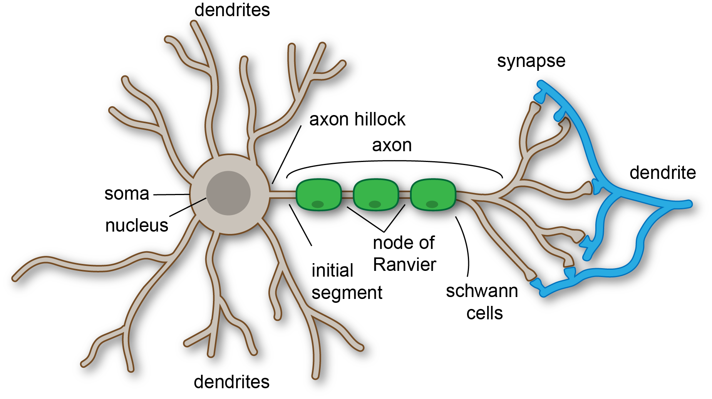

# Biological Inspiration in Neural Networks

The foundation of artificial neural networks is inspired by the
**structure and functioning of the human brain**. By mimicking the way
biological neurons process and transmit information, neural networks can
model complex relationships and learn from data efficiently.

------------------------------------------------------------------------

## 1. The Human Brain and Neurons

In our brain, we have **neurons**, which are like tiny messengers.  
Each neuron receives information from other neurons, processes it, and
sends the result to other neurons.

[Image Credit](https://www.shutterstock.com/search/neuron-diagram)

### **Structure and Function of Biological Neurons**

-   A **biological neuron** is a specialized cell in the nervous system
    responsible for transmitting information throughout the body.
-   Each neuron consists of:
    -   **Dendrites**: Branch-like structures that receive electrical
        signals from other neurons.
    -   **Cell body (soma)**: Processes incoming signals.
    -   **Axon**: Long projection that transmits the signal to the next
        neuron.
    -   **Axon terminals**: Ends of the axon that send signals to
        neighboring neurons.

### **Synapses and Neurotransmission**

-   The **synapse** is the junction between two neurons where
    communication occurs.
-   Signals travel from the axon terminal of one neuron to the dendrite
    of another.
-   This communication is chemical and electrical:
    -   Electrical signal → triggers release of **neurotransmitters**
    -   Neurotransmitters cross the synapse and bind to receptors on the
        receiving neuron
-   The receiving neuron either **fires** (activates) or **does not
    fire** based on the signal strength.

> **Example:**  
> Imagine you touch a hot cup.  
> Your **sensory neurons** send a signal (“it’s hot!”) to your brain,  
> your brain processes it, and your **motor neurons** tell your hand to
> pull away.

------------------------------------------------------------------------

## 2. Artificial Neurons

In deep learning, we try to mimic this behavior using **artificial
neurons**.

Artificial neurons (also known as **perceptrons**) are mathematical
functions inspired by biological neurons. They form the building blocks
of **artificial neural networks (ANNs)**.

An **artificial neuron** is a simple mathematical function that: 1.
Takes some inputs (like numbers). 2. Applies weights (importance) to
each input. 3. Adds them up. 4. Passes the result through an
**activation function** (like deciding whether the message is important
enough to send).

### **Structure of an Artificial Neuron**

Each artificial neuron performs a weighted sum of inputs, applies an
activation function, and produces an output.

**Mathematically**:

$$
\large y = f\left(\sum w{\scriptstyle i} x{\scriptstyle i} + b\right)
$$

Where:

-   *x**i*: Input features
-   *w**i*: Weights applied to inputs
-   *b*: Bias term
-   *f*: Activation function (e.g., sigmoid, ReLU)
-   *y*: Output

### **Components:**

-   **Inputs**: Data fed into the neuron (e.g., pixel values of an
    image).
-   **Weights**: Indicate the importance of each input.
-   **Bias**: A constant value that helps shift the activation function.
-   **Summation Function**: Computes the weighted sum of inputs.
-   **Activation Function**: Determines whether the neuron should fire
    (produce an output).

------------------------------------------------------------------------

## 3. Comparison: Biological vs. Artificial Neurons

[Image
Credit](https://www.researchgate.net/publication/374772993_Quantum_machine_learning_based_on_continuous_variable_single-photon_states_an_elementary_foundation_for_quantum_neural_networks/figures?lo=1)

<table>
<colgroup>
<col style="width: 22%" />
<col style="width: 36%" />
<col style="width: 40%" />
</colgroup>
<thead>
<tr>
<th>Aspect</th>
<th>Biological Neuron</th>
<th>Artificial Neuron</th>
</tr>
</thead>
<tbody>
<tr>
<td><strong>Basic Unit</strong></td>
<td>Neuron (nerve cell)</td>
<td>Perceptron or node</td>
</tr>
<tr>
<td><strong>Input</strong></td>
<td>Electrical signals from dendrites</td>
<td>Numeric features or signals</td>
</tr>
<tr>
<td><strong>Processing</strong></td>
<td>Integration in the cell body</td>
<td>Weighted sum of inputs + bias</td>
</tr>
<tr>
<td><strong>Output</strong></td>
<td>Signal via axon terminals</td>
<td>Output value after activation function</td>
</tr>
<tr>
<td><strong>Signal Transmission</strong></td>
<td>Chemical (neurotransmitters) + Electrical</td>
<td>Purely mathematical computation</td>
</tr>
<tr>
<td><strong>Learning Mechanism</strong></td>
<td>Synaptic plasticity (adjusts synaptic strength)</td>
<td>Weight adjustment via backpropagation</td>
</tr>
</tbody>
</table>

------------------------------------------------------------------------

## Summary

-   **Biological neurons** are the basis for thought and learning in the
    human brain.
-   **Artificial neurons** mimic their structure and behavior
    mathematically to process data.
-   While simpler, artificial neurons and their networks have enabled
    machines to learn complex tasks such as image recognition, speech
    processing, and decision making—mirroring aspects of human
    cognition.

Understanding this analogy helps bridge the gap between neuroscience and
artificial intelligence, providing a strong foundation for grasping how
neural networks function.
